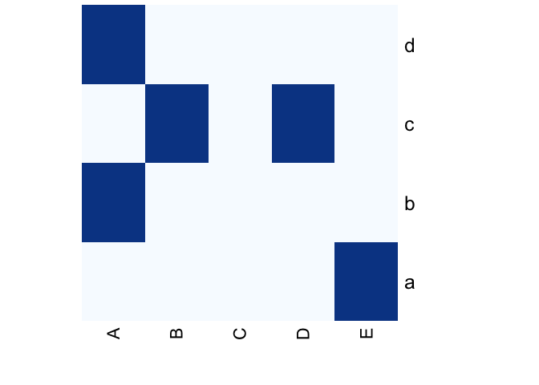
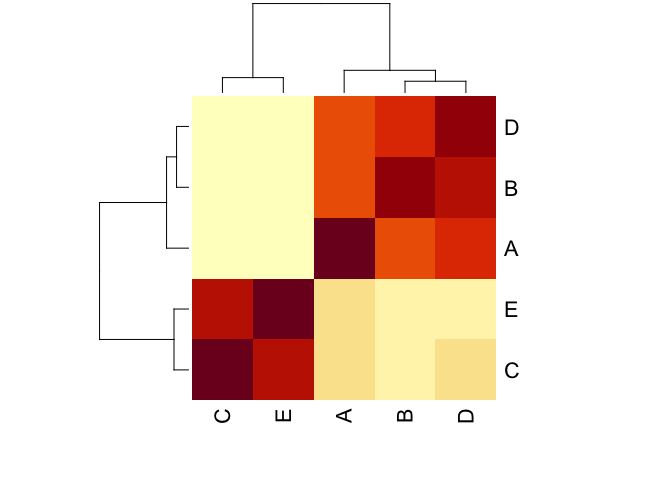
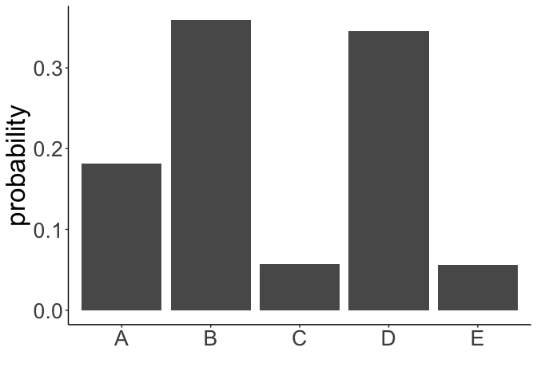

<!-- README.md is generated from README.Rmd. Please edit that file -->
<!-- Good examples for for the README and article:
        - https://github.com/LieberInstitute/spatialLIBD/blob/devel/README.Rmd
-->

# RESOLDRE

**RESOLDRE** is an R package for generating “correlation-informed” null
models, which combine the classic concept of null models and tools from
joint statistical modeling in community ecology. Such models can be used
to assess whether the information encoded within any given correlation
matrix is predictive for explaining structural patterns observed within
an incidence matrix.

## How to cite?

To use this software, please make sure you cite Bramon Mora et.
al. (*Unmasking structural patterns in incidence matrices: an
application to ecological data.* Journal of the Royal Society Interface,
2019).

## Installation instructions

Installation should be relatively painless:

you can install the R package with `remotes` as:

``` r
library(remotes)
install_github('bernibra/RESOLDRE')
```

## Example run

Let’s write the toy example presented in the paper. First the incidence
matrix:

``` r
mat <- as.matrix(rbind(c(0,0,0,0,1),
                      c(1,0,0,0,0),
                      c(0,1,0,1,0),
                      c(1,0,0,0,0)))
rownames(mat) <- c("a", "b", "c", "d")
colnames(mat) <- c("A", "B", "C", "D", "E")
heatmap(mat, Rowv = NA, Colv = NA, col= colorRampPalette(RColorBrewer::brewer.pal(8, "Blues"))(2))
```



Notice that row ‘c’, just like in the manuscript, contains two links:
(c-B) and (c-D).

Now let’s make up a correlation matrix that reflects Figure 1 of the
paper.

``` r
library(ggplot2)
cormed <- as.matrix(rbind(c(1,0.7,0.1,0.75,0.15),
                      c(0.7,1,0.05,0.85,0.1),
                      c(0.1,0.05,1,0.1,0.8),
                      c(0.75,0.85,0.15,1,0.1),
                      c(0.15,0.1,0.8,0.1,1)))

colnames(cormed) <- c("A", "B", "C", "D", "E")
rownames(cormed) <- c("A", "B", "C", "D", "E")
heatmap(cormed)
```



As you can see, columns A, B and D are highly correlated while being
uncorrelated with C and E, and C and E are in turn highly correlated
with each other.

The first thing we can do is check whether the probability values
generated using the PGLMM (provided by function
`probability_estimation`) follow a similar profile to that of the
example in Figure 1.

``` r
library(RESOLDRE)
pmat <- probability_estimation(mat = mat, vcv = cormed, perspective = "columns")
ggplot(data.frame(y = pmat[3,], x = colnames(mat)), aes(x=x, y=y))+
           geom_col() + theme_classic() +
           labs(x = "", y = "probability") +
           theme(text = element_text(size = 25))
```



Then, we can use the function `resoldre()` to randomize the matrix
either using the new `pmat` or direclty using correlation matrix
`cormed`:

``` r
library(RESOLDRE)
rmat <- resoldre(mat = mat, cormed = cormed, perspective = "columns", bipartite = T)
```

Notice that we use the option `bipartite = T` to indicate that this is
not a square matrix.

For the sake of showcasing what the algorithm does, we can calculate the
ratio between the number of times that we find the link (c-E) relative
to the link (c-A) when using the informed and the uninformed
randomization strategy.

``` r
library(dplyr)
library(knitr)

n <- 10000
informed <- resoldre(mat = mat, cormed = cormed, perspective = "columns", bipartite = T, randomizations = n)
uninformed <- resoldre(mat = mat, perspective = "columns", bipartite = T, randomizations = n)

data.frame(
  informed = 
    sum(sapply(informed, function(x) x["c", "E"]))/sum(sapply(informed, function(x) x["c", "A"])), 
  uninformed = 
    sum(sapply(uninformed, function(x) x["c", "E"]))/sum(sapply(uninformed, function(x) x["c", "A"]))
           ) %>%
  kable()
```

|  informed | uninformed |
|----------:|-----------:|
| 0.0843215 |  0.4895172 |

As expected, the informed randomization strategy makes the appearance of
the link (c-E) much less likely than in the uninformed strategy, as the
correlation structure tells the null model that B and D are similar to A
and very different to E.

*As of now, a warning might pop up if the matrix is very small asking
you to increase the permutations. You can safely ignore it, as the
triggering of this warning was designed for bigger matrices. I should
probably fix this…*

## Data accessability

The data used in Bramon Mora et. al. (year) to present the software can
be find in the `./inst/extdata` directory. In particular, we used two
different datasets:

1.  The first example used in the paper is an application of the
    software to food webs in order to study how well species’
    evolutionary relationships can explain observed patterns of
    predator-pray interactions. The data used for this can be found in
    `./inst/extdata/foodwebs` and describes 10 empirical food webs from
    small streams of the Taieri River in New Zealand comprising fish,
    macroinvertebrates and algae (Townsend et al., 1998). Every
    directory in `./inst/extdata/foodwebs` describes a different food
    web (in total, there are 10 food webs). For every food web, we
    provide three files ‘interactions.txt’, ‘species.txt’ and
    ‘output_tree.new’ describing the list of of interactions composing
    the food webs, the list of species involved in these interactions
    and the phylogenetic tree characterizing the evolutionary history of
    such species, respectively. Notice that the code used for the
    different species in ‘interactions.txt’ is an integer number that
    represents the position of the species in ‘species.txt’. Although
    the data is available online, make sure you cite Townsend et
    al. (1998) if you want to use it.

2.  The second example used in the paper is an application of the to
    software species assemblages in order to study how well possible
    spatial autocorrelations or area similarity between sample sites as
    well as island richness and species range similarity can explain the
    structural patterns observed in these communities. The data used for
    this can be found in `./inst/extdata/biogeography` and describes the
    distribution of 366 species of vascular plants across 80 islands
    from the San Juan archipelago (Marx et al., 2015a; Marx et al.,
    2015b). In particular, we provide an R script that downloads the
    files ‘DRYAD1_ComMatrix.csv’ and ‘DRYAD2_SJtraits.csv’ from the
    journal ‘Diversity and Distributions’, which describe the incidence
    matrix for this species assemblage and the list of species traits,
    respectively. Although the data is available online, plase make sure
    you cite Marx et al. (2015a; 2015b) if you want to use it.
